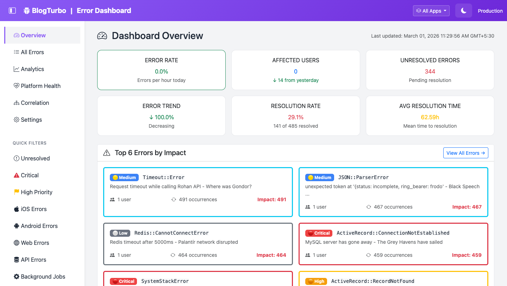
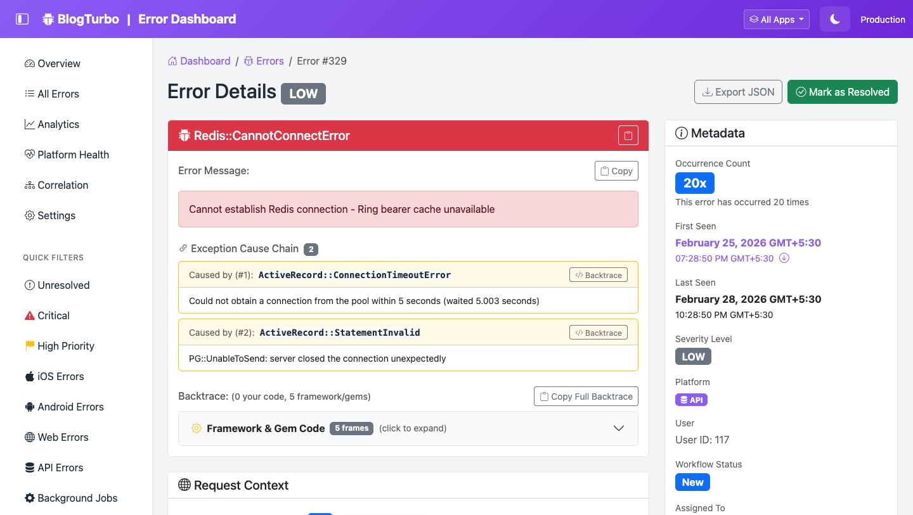
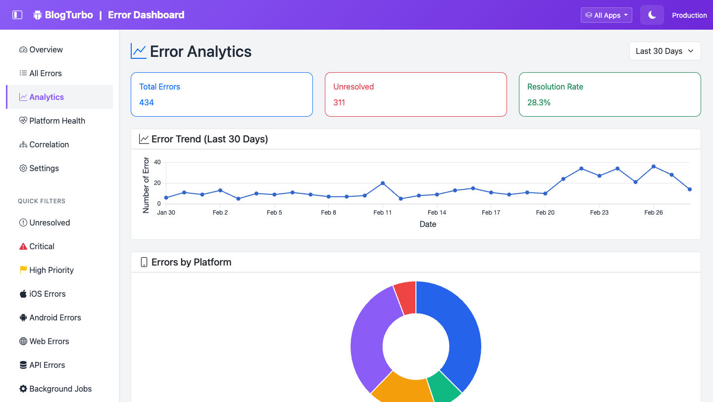

# Rails Error Dashboard

[](https://badge.fury.io/rb/rails_error_dashboard)
[](https://rubygems.org/gems/rails_error_dashboard)
[](https://opensource.org/licenses/MIT)
[](https://github.com/AnjanJ/rails_error_dashboard/actions)
[](https://buymeacoffee.com/anjanj)

**Self-hosted Rails error monitoring — free, forever.**

```ruby
gem 'rails_error_dashboard'
```

**5-minute setup** · **Works out-of-the-box** · **100% Rails + Postgres** · **No vendor lock-in**

[Full Documentation](https://anjanj.github.io/rails_error_dashboard/) · [Live Demo](https://rails-error-dashboard.anjan.dev) · [RubyGems](https://rubygems.org/gems/rails_error_dashboard)

---

### Try the Live Demo

**[rails-error-dashboard.anjan.dev](https://rails-error-dashboard.anjan.dev)** — Username: `gandalf` · Password: `youshallnotpass`

> **Beta Software** — Functional and tested (2,100+ tests passing), but the API may change before v1.0. Supports Rails 7.0-8.1 and Ruby 3.2-4.0.

### Screenshots

**Dashboard Overview** — Real-time error stats, severity breakdown, and trend charts.



**Error Detail** — Full stack trace, cause chain, enriched context, and workflow management.



---

## Who This Is For

- **Solo bootstrappers** who need professional error tracking without recurring costs
- **Indie SaaS founders** building profitable apps on tight budgets
- **Small dev teams** (2-5 people) who hate SaaS bloat
- **Privacy-conscious apps** that need to keep error data on their own servers
- **Side projects** that might become real businesses

## What It Replaces

| Before | After |
|--------|-------|
| $29-99/month for error monitoring | $0/month — runs on your existing Rails server |
| Sensitive error data sent to third parties | All data stays on your infrastructure |
| SaaS pricing tiers and usage limits | Unlimited errors, unlimited projects |
| Vendor lock-in with proprietary APIs | 100% open source, fully portable |
| Complex SDK setup and external services | 5-minute Rails Engine installation |

---

## Features

### Core (Always Enabled)

Error capture from controllers, jobs, and middleware. Beautiful Bootstrap 5 dashboard with dark/light mode, search, filtering, and real-time updates. Analytics with trend charts, severity breakdown, and spike detection. Workflow management with assignment, priority, snooze, comments, and batch operations. Security via HTTP Basic Auth or custom lambda (Devise, Warden, session-based). Exception cause chains, enriched HTTP context, custom fingerprinting, CurrentAttributes integration, auto-reopen on recurrence, and sensitive data filtering — all built in.

### Optional Features

<details>
<summary><strong>Breadcrumbs — Request Activity Trail</strong></summary>

See exactly what happened before the crash — SQL queries, controller actions, cache operations, job executions, and mailer deliveries captured automatically via `ActiveSupport::Notifications`.

- Automatic capture — zero config beyond the enable flag
- N+1 query detection with aggregate patterns page
- Deprecation warnings with aggregate view
- Custom breadcrumbs via `RailsErrorDashboard.add_breadcrumb("checkout started", { cart_id: 123 })`
- Safe by design — fixed-size ring buffer, thread-local, every subscriber wrapped in rescue

```ruby
config.enable_breadcrumbs = true
```

[Complete documentation →](docs/FEATURES.md#breadcrumbs--request-activity-trail-new)
</details>

<details>
<summary><strong>System Health Snapshot</strong></summary>

Know your app's runtime state at the moment of failure — GC stats, process memory, thread count, connection pool utilization, and Puma thread stats captured automatically.

- Sub-millisecond total snapshot, every metric individually rescue-wrapped
- No ObjectSpace scanning, no Thread backtraces, no subprocess calls

```ruby
config.enable_system_health = true
```

[Complete documentation →](docs/FEATURES.md#system-health-snapshot-new)
</details>

<details>
<summary><strong>N+1 Detection + Deprecation Warnings</strong></summary>

Cross-error N+1 detection grouped by SQL fingerprint, and aggregate deprecation warnings with occurrence counts.


Requires breadcrumbs to be enabled.

[Complete documentation →](docs/FEATURES.md#n1-query-detection)
</details>

<details>
<summary><strong>Operational Health Panels — Jobs, Database, Cache</strong></summary>

**Job Health** — Auto-detects Sidekiq, SolidQueue, or GoodJob. Per-error table with adapter badge, failed count (color-coded), sorted worst-first.


**Database Health** — PgHero-style live PostgreSQL stats (table sizes, unused indexes, dead tuples, vacuum timestamps) plus historical connection pool data from error snapshots.


**Cache Health** — Per-error cache performance sorted worst-first.


[Complete documentation →](docs/FEATURES.md#job-health-page)
</details>

<details>
<summary><strong>Source Code Integration + Git Blame</strong></summary>

View actual source code directly in error backtraces with +/-7 lines of context. Git blame shows who last modified the code, when, and the commit message. Repository links jump to GitHub/GitLab/Bitbucket at the exact line.

```ruby
config.enable_source_code_integration = true
config.enable_git_blame = true
```

[Complete documentation →](docs/SOURCE_CODE_INTEGRATION.md)
</details>

<details>
<summary><strong>Error Replay — Copy as cURL / RSpec</strong></summary>

Replay failing requests with one click. Copy the request as a cURL command or generate an RSpec test from the captured error context.

[Complete documentation →](docs/FEATURES.md#error-details-page)
</details>

<details>
<summary><strong>Notifications — Slack, Discord, PagerDuty, Email, Webhooks</strong></summary>

Multi-channel alerting with severity filters, per-error cooldown, and milestone threshold alerts to prevent alert fatigue.

```ruby
config.enable_slack_notifications = true
config.slack_webhook_url = ENV['SLACK_WEBHOOK_URL']
```

[Notification setup guide →](docs/guides/NOTIFICATIONS.md)
</details>

<details>
<summary><strong>Advanced Analytics</strong></summary>



Seven analysis engines built in:

1. **Baseline Anomaly Alerts** — Statistical spike detection (mean + std dev) with intelligent cooldown
2. **Fuzzy Error Matching** — Jaccard similarity + Levenshtein distance to find related errors
3. **Co-occurring Errors** — Detect errors that happen together within configurable time windows
4. **Error Cascade Detection** — Identify chains (A causes B causes C) with probability and delays
5. **Error Correlation Analysis** — Correlate errors with app versions, git commits, and users
6. **Platform Comparison** — iOS vs Android vs Web health metrics side-by-side
7. **Occurrence Pattern Detection** — Cyclical patterns (business hours, weekends) and burst detection

[Complete documentation →](docs/FEATURES.md#advanced-analytics-features)
</details>

<details>
<summary><strong>Plugin System</strong></summary>

Event-driven extensibility with hooks for `on_error_logged`, `on_error_resolved`, `on_threshold_exceeded`. Built-in examples for Jira integration, metrics tracking, and audit logging.

```ruby
class MyPlugin < RailsErrorDashboard::Plugin
  def on_error_logged(error_log)
    # Your custom logic
  end
end
```

[Plugin System guide →](docs/PLUGIN_SYSTEM.md)
</details>

---

## Quick Start

### 1. Add to Gemfile

```ruby
gem 'rails_error_dashboard'
```

### 2. Install with Interactive Setup

```bash
bundle install
rails generate rails_error_dashboard:install
rails db:migrate
```

The installer guides you through optional feature selection — notifications, performance optimizations, advanced analytics. All features are opt-in.

### 3. Visit your dashboard

```
http://localhost:3000/error_dashboard
```

Default credentials: `gandalf` / `youshallnotpass`

**Change these before production!** Edit `config/initializers/rails_error_dashboard.rb`

### 4. Test it out

```ruby
# In Rails console or any controller
raise "Test error from Rails Error Dashboard!"
```

[Full installation guide →](docs/QUICKSTART.md)

---

## Configuration

```ruby
RailsErrorDashboard.configure do |config|
  # Authentication
  config.dashboard_username = ENV.fetch('ERROR_DASHBOARD_USER', 'gandalf')
  config.dashboard_password = ENV.fetch('ERROR_DASHBOARD_PASSWORD', 'youshallnotpass')

  # Or use your existing auth (Devise, Warden, etc.):
  # config.authenticate_with = -> { warden.authenticated? }

  # Optional features — enable as needed
  config.enable_slack_notifications = true
  config.slack_webhook_url = ENV['SLACK_WEBHOOK_URL']
  config.async_logging = true
  config.async_adapter = :sidekiq  # or :solid_queue, :async
end
```

[Complete configuration guide →](docs/guides/CONFIGURATION.md)

**Multi-App Support** — Track errors from multiple Rails apps in a single shared database. Auto-detects app name, supports per-app filtering. [Multi-App guide →](docs/MULTI_APP_PERFORMANCE.md)

---

## Documentation

### Getting Started
- **[Quickstart Guide](docs/QUICKSTART.md)** — 5-minute setup
- **[Configuration](docs/guides/CONFIGURATION.md)** — All configuration options
- **[Uninstalling](docs/UNINSTALL.md)** — Clean removal

### Features
- **[Complete Feature List](docs/FEATURES.md)** — Every feature explained
- **[Notifications](docs/guides/NOTIFICATIONS.md)** — Multi-channel alerting
- **[Source Code Integration](docs/SOURCE_CODE_INTEGRATION.md)** — Inline source + git blame
- **[Batch Operations](docs/guides/BATCH_OPERATIONS.md)** — Bulk resolve/delete
- **[Real-Time Updates](docs/guides/REAL_TIME_UPDATES.md)** — Live dashboard
- **[Error Trends](docs/guides/ERROR_TREND_VISUALIZATIONS.md)** — Charts and analytics

### Advanced
- **[Multi-App Support](docs/MULTI_APP_PERFORMANCE.md)** — Track multiple applications
- **[Plugin System](docs/PLUGIN_SYSTEM.md)** — Build custom integrations
- **[API Reference](docs/API_REFERENCE.md)** — Complete API documentation
- **[Customization](docs/CUSTOMIZATION.md)** — Customize everything
- **[Database Options](docs/guides/DATABASE_OPTIONS.md)** — Separate database setup
- **[Database Optimization](docs/guides/DATABASE_OPTIMIZATION.md)** — Performance tuning
- **[Mobile App Integration](docs/guides/MOBILE_APP_INTEGRATION.md)** — React Native, Flutter, etc.
- **[FAQ](docs/FAQ.md)** — Common questions answered

[View all documentation →](docs/README.md)

---

## Architecture

Built with **CQRS (Command/Query Responsibility Segregation)**:
- **Commands** — LogError, ResolveError, BatchOperations (writes)
- **Queries** — ErrorsList, DashboardStats, Analytics (reads)
- **Services** — PlatformDetector, SimilarityCalculator (business logic)
- **Plugins** — Event-driven extensibility

---

## Testing

2,100+ tests covering unit, integration, and browser-based system tests.

```bash
bundle exec rspec                              # Full suite
bundle exec rspec spec/system/                 # System tests (Capybara + Cuprite)
HEADLESS=false bundle exec rspec spec/system/  # Visible browser
```

---

## Contributing

1. Fork the repository
2. Create your feature branch (`git checkout -b feature/amazing-feature`)
3. Write tests, ensure all pass (`bundle exec rspec`)
4. Commit and push
5. Open a Pull Request

```bash
git clone https://github.com/AnjanJ/rails_error_dashboard.git
cd rails_error_dashboard
bin/setup  # Installs deps, hooks, runs tests
```

[Development guide →](DEVELOPMENT.md) · [Testing guide →](docs/development/TESTING.md)

---

## License

Available as open source under the [MIT License](https://opensource.org/licenses/MIT).

## Acknowledgments

Built with [Rails](https://rubyonrails.org/) · UI by [Bootstrap 5](https://getbootstrap.com/) · Charts by [Chart.js](https://www.chartjs.org/) · Pagination by [Pagy](https://github.com/ddnexus/pagy)

## Contributors

[](https://github.com/AnjanJ/rails_error_dashboard/graphs/contributors)

Special thanks to [@bonniesimon](https://github.com/bonniesimon), [@gundestrup](https://github.com/gundestrup), and [@midwire](https://github.com/midwire). See [CONTRIBUTORS.md](CONTRIBUTORS.md) for the full list.

---

## Support

If this gem saves you some headaches (or some money on error tracking SaaS), consider [buying me a coffee](https://buymeacoffee.com/anjanj). It keeps the project going and lets me know people are finding it useful.

---

**Made with care by [Anjan](https://www.anjan.dev) for the Rails community**

*One Gem to rule them all, One Gem to find them, One Gem to bring them all, and in the dashboard bind them.*
