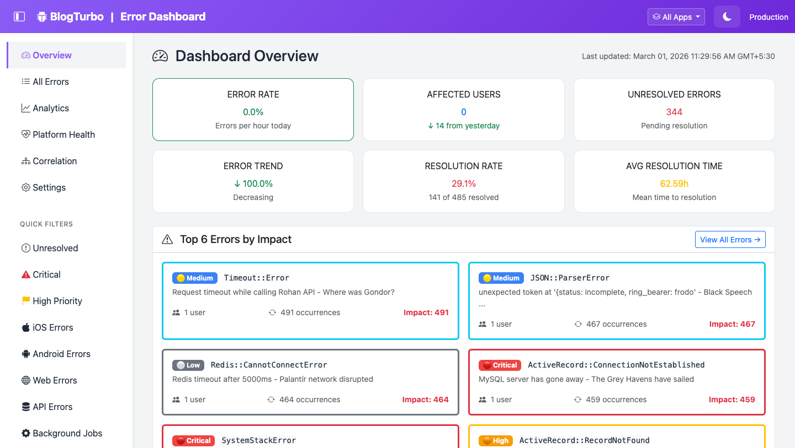
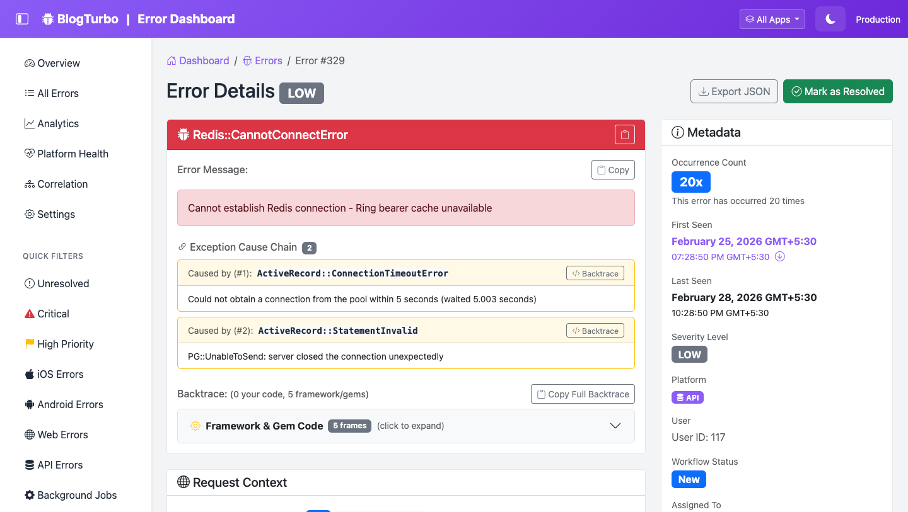
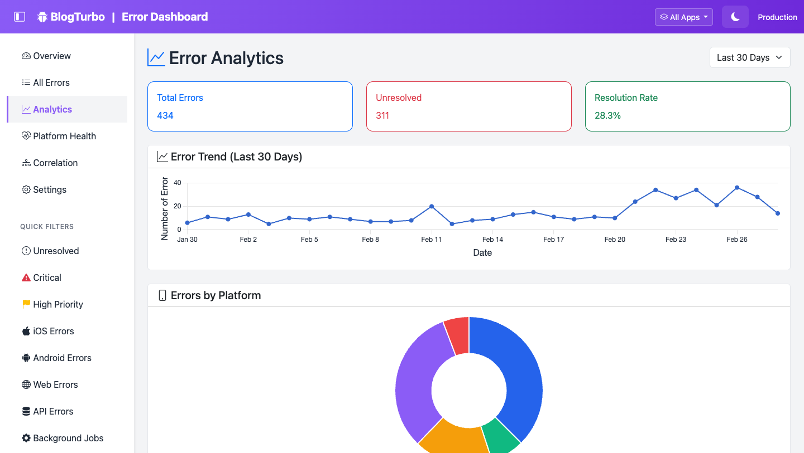
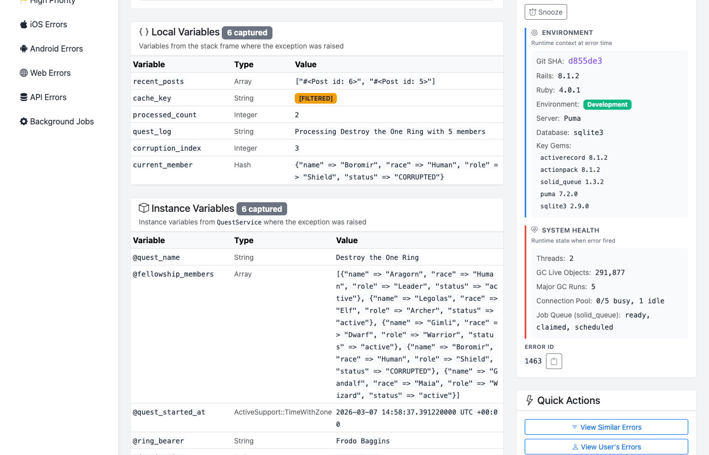
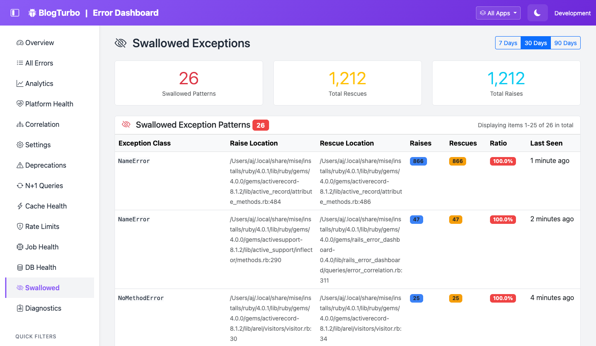
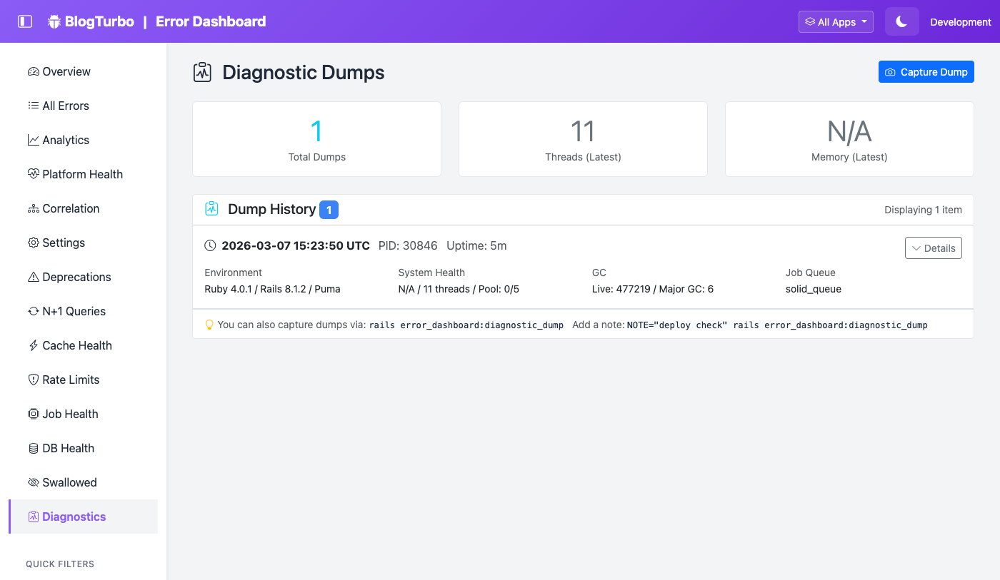

# Rails Error Dashboard

[](https://codecov.io/gh/gundestrup/rails_error_dashboard)


[](https://badge.fury.io/rb/rails_error_dashboard)
[](https://rubygems.org/gems/rails_error_dashboard)
[](https://opensource.org/licenses/MIT)
[](https://github.com/AnjanJ/rails_error_dashboard/actions)
[](https://github.com/sponsors/AnjanJ)
[](https://buymeacoffee.com/anjanj)

**Self-hosted Rails error monitoring — free, forever.**

```ruby
gem 'rails_error_dashboard'
```

**5-minute setup** · **Works out-of-the-box** · **PostgreSQL, MySQL/Trilogy, SQLite — shared or separate database** · **No vendor lock-in**

[Full Documentation](https://anjanj.github.io/rails_error_dashboard/) · [Live Demo](https://rails-error-dashboard.anjan.dev) · [RubyGems](https://rubygems.org/gems/rails_error_dashboard)

---

### Try the Live Demo

**[rails-error-dashboard.anjan.dev](https://rails-error-dashboard.anjan.dev)** — Username: `gandalf` · Password: `youshallnotpass`

> **Beta Software** — Functional and tested (2,700+ tests passing), but the API may change before v1.0. Supports Rails 7.0-8.1 and Ruby 3.2-4.0.

### Screenshots

**Dashboard Overview** — Real-time error stats, severity breakdown, and trend charts.



**Error Detail** — Full stack trace, cause chain, enriched context, and workflow management.



**AI Help** — Optional OpenAI or Anthropic assistance streamed directly inside the error detail page.


---

## From the Community

> All three [self-hosted alternatives] had an issue with error backtrace when using Turbo — RED did fix it… solid_errors and Faultline are not very active projects, RED is very active and @AnjanJ is very responsive in fixing issues. So, RED was my final choice.
>
> — **Gael Marziou** ([@gmarziou](https://github.com/gmarziou)) · [read the full discussion](https://github.com/AnjanJ/rails_error_dashboard/discussions/116)

---

## Who This Is For

- **Solo bootstrappers** who need professional error tracking without recurring costs
- **Indie SaaS founders** building profitable apps on tight budgets
- **Small dev teams** (2-5 people) who hate SaaS bloat
- **Privacy-conscious apps** that need to keep error data on their own servers
- **Side projects** that might become real businesses

## What It Replaces

| Before | After |
|--------|-------|
| $29-99/month for error monitoring | $0/month — runs on your existing Rails server |
| Sensitive error data sent to third parties | All data stays on your infrastructure |
| SaaS pricing tiers and usage limits | Unlimited errors, unlimited projects |
| Vendor lock-in with proprietary APIs | 100% open source, fully portable |
| Complex SDK setup and external services | 5-minute Rails Engine installation |
| Pay extra for local variable capture (Sentry) | Local + instance variables included free |
| No tool detects silently rescued exceptions | Swallowed exception detection built in |

---

## Features

### Core (Always Enabled)

Error capture from controllers, jobs, and middleware. Custom-designed dashboard with dark/light mode, search, filtering, and real-time updates. Analytics with trend charts, severity breakdown, and spike detection. Workflow management with assignment, priority, snooze, mute/unmute (notification suppression), comments, and batch operations. Security via HTTP Basic Auth or custom lambda (Devise, Warden, session-based). Exception cause chains, enriched HTTP context, custom fingerprinting, CurrentAttributes integration, auto-reopen on recurrence, and sensitive data filtering — all built in.

### Optional Features

<details>
<summary><strong>Storm Protection — Circuit Breaker + Adaptive Sampling</strong></summary>

When the error rate spikes (a bad deploy throwing thousands of errors a minute), the nightmare scenario for any in-process tracker is amplifying the outage with its own database writes. Storm protection makes the gem **provably degrade itself first** — ON by default.

- **Per-fingerprint caps:** past N occurrences/minute per error, context is shed, then rows are sampled deterministically (a fresh exemplar is always kept each minute)
- **Global circuit breaker:** sustained floods flip the gem to count-only mode — zero per-event I/O, exact in-memory counts reconciled onto error records every 30s. Async mode is gated too (a SolidQueue enqueue is itself a DB write)
- **One storm notification** replaces hundreds of per-error pings; auto-issue creation is capped (default 5 per 10 min) so a storm of new errors can't open 500 GitHub/Linear issues
- **Honest accounting:** a dashboard banner during/after the storm, a Storm History page with exact counts of everything shed, and `reached_open`/peak-rate per episode. Counts are never extrapolated
- **Calm-weather economy:** after 25 full-context captures of the same error per day, context is sampled (occurrence counting unaffected)
- **Fails open:** any internal storm-protection error means full capture. Protection can never be the thing that loses an error

```ruby
config.enable_storm_protection = true  # default
config.storm_open_threshold_per_second = 50  # per process
```

All thresholds are per process and individually configurable. Disable with one flag.

**Measured overhead** (Apple Silicon, Ruby 4.0): 2.4µs/error with protection active and calm, 2.95µs in count-only mode, 0.2µs when disabled — against a 5µs budget. The check is a digest plus an atomic increment; there is no I/O on the hot path.
</details>

<details>
<summary><strong>Breadcrumbs — Request Activity Trail</strong></summary>

See exactly what happened before the crash — SQL queries, controller actions, cache operations, job executions, and mailer deliveries captured automatically via `ActiveSupport::Notifications`.

- Automatic capture — zero config beyond the enable flag
- N+1 query detection with aggregate patterns page
- Deprecation warnings with aggregate view
- Custom breadcrumbs via `RailsErrorDashboard.add_breadcrumb("checkout started", { cart_id: 123 })`
- Safe by design — fixed-size ring buffer, thread-local, every subscriber wrapped in rescue

```ruby
config.enable_breadcrumbs = true
```

[Complete documentation →](docs/FEATURES.md#breadcrumbs--request-activity-trail-new)
</details>

<details>
<summary><strong>System Health Snapshot</strong></summary>

Know your app's runtime state at the moment of failure — GC stats, process memory, thread count, connection pool utilization, Puma thread stats, RubyVM cache health, YJIT compilation stats, and deep runtime insights captured automatically.

- Sub-millisecond total snapshot, every metric individually rescue-wrapped
- No ObjectSpace scanning, no Thread backtraces, no subprocess calls
- RubyVM.stat: constant cache invalidations, shape cache stats
- YJIT runtime stats: compiled iseqs, invalidation count, code region sizes
- **v0.5.2** — File descriptor utilization, system load averages, system memory pressure, TCP connection states, GC context (trigger reason, last major/minor), process swap and peak RSS — all with color-coded danger indicators

```ruby
config.enable_system_health = true
```

[Complete documentation →](docs/FEATURES.md#system-health-snapshot-new)
</details>

<details>
<summary><strong>N+1 Detection + Deprecation Warnings</strong></summary>

Cross-error N+1 detection grouped by SQL fingerprint, and aggregate deprecation warnings with occurrence counts.


Requires breadcrumbs to be enabled.

[Complete documentation →](docs/FEATURES.md#n1-query-detection)
</details>

<details>
<summary><strong>Operational Health Panels — Jobs, Database, Cache, ActionCable</strong></summary>

**Job Health** — Auto-detects Sidekiq, SolidQueue, or GoodJob. Per-error table with adapter badge, failed count (color-coded), sorted worst-first.


**Database Health** — PgHero-style live PostgreSQL stats (table sizes, unused indexes, dead tuples, vacuum timestamps) plus historical connection pool data from error snapshots. PostgreSQL-only for the system-table views; MySQL and SQLite show connection pool stats and hide the rest.


**Cache Health** — Per-error cache performance sorted worst-first.


**ActionCable Health** — Track WebSocket channel actions, transmissions, subscription confirmations, and rejections. Dashboard page at `/errors/actioncable_health_summary` with channel breakdown sorted by rejections. System health snapshot captures live connection count and adapter.

```ruby
config.enable_actioncable_tracking = true  # requires enable_breadcrumbs = true
```

**ActiveStorage Health** — Track file uploads, downloads, deletes, and existence checks across storage services (Disk, S3, GCS, Azure — any ActiveStorage backend). Dashboard page at `/errors/activestorage_health_summary` with per-service operation counts, average and slowest durations. Helps identify slow storage operations correlating with errors.

```ruby
config.enable_activestorage_tracking = true  # requires enable_breadcrumbs = true
```

[Complete documentation →](docs/FEATURES.md#job-health-page)
</details>

<details>
<summary><strong>LLM Observability — Calls, Tokens, Cost, Tool Use</strong></summary>

Capture every LLM call your app makes — model, latency, token counts, estimated USD cost, and tool-use requests — as breadcrumbs on the error that follows. When a request crashes, you see the chat completion that preceded it: which model was called, how long it took, what it cost, and which tools it asked to invoke.

- Three capture paths — pick whichever matches your stack
- Cost estimated from a built-in pricing table (Claude 4.x, GPT-4o/o1, Gemini 2.5) — override per-model via `config.llm_pricing_overrides`
- Tool-call requests summarized inline; tool *execution* spans captured separately via the OTel path
- Content capture (prompts/completions) **OFF by default** — only token counts and metadata are recorded
- Same host-app safety guarantees as the rest of the gem — never raises, never blocks the request, every callback rescue-wrapped

```ruby
config.enable_breadcrumbs        = true   # required — LLM crumbs ride the breadcrumb pipeline
config.enable_llm_observability  = true
# Optional — override the built-in pricing table for your account
# config.llm_pricing_overrides = { "claude-sonnet-4-6" => { input: 3.0, output: 15.0 } }
```

**Path A — `ruby-openai` (Faraday middleware)**

```ruby
# Gemfile already has: gem "ruby-openai"
client = OpenAI::Client.new do |f|
  f.use RailsErrorDashboard::Integrations::LlmMiddleware
end
```

**Path B — `ruby_llm` (OpenTelemetry)**

`ruby_llm` doesn't expose a Faraday hook, but the thoughtbot OTel instrumentation gem emits GenAI-semconv spans that our SpanProcessor picks up automatically.

```ruby
# Gemfile
gem "ruby_llm"
gem "opentelemetry-sdk"
gem "opentelemetry-instrumentation-ruby_llm"

# config/initializers/opentelemetry.rb
OpenTelemetry::SDK.configure do |c|
  c.use "OpenTelemetry::Instrumentation::RubyLLM"
end
```

The dashboard's `LlmSpanProcessor` registers itself with `OpenTelemetry.tracer_provider` during engine boot — no extra wiring.

**Path C — anything else (Anthropic official SDK, Net::HTTP, gRPC, Ollama, …)**

The official `anthropic` gem uses `Net::HTTP` directly (no Faraday hook), and many local-inference setups don't run OTel. Wrap any LLM call in `ActiveSupport::Notifications.instrument` — pass a mutable Hash so token counts can be filled in *after* the call:

```ruby
payload = { provider: "anthropic", model: "claude-sonnet-4-6" }

ActiveSupport::Notifications.instrument("red.llm_call", payload) do
  response = Anthropic::Client.new.messages.create(
    model: "claude-sonnet-4-6",
    messages: [ { role: "user", content: "hi" } ]
  )
  payload[:input_tokens]  = response.usage.input_tokens
  payload[:output_tokens] = response.usage.output_tokens
end

# Tool execution — captured as its own llm_tool breadcrumb
ActiveSupport::Notifications.instrument("red.llm_tool_call",
  tool_name: "search_database",
  tool_arguments: { query: "..." }
) do
  # run the tool
end
```

Payload contract matches the `LlmCallEvent` value object — see [`docs/LLM_OBSERVABILITY.md`](docs/LLM_OBSERVABILITY.md) for the full field list.
</details>

<details>
<summary><strong>Issue Tracking — GitHub, GitLab, Codeberg, Linear</strong></summary>

One switch connects errors to your issue tracker. Platform becomes the source of truth — status, assignees, labels, and comments are mirrored live in the dashboard.

- **Create & link:** "Create Issue" button or paste an existing URL
- **Auto-create:** New errors auto-create issues. Critical/high severity always creates
- **Lifecycle sync:** Resolve → close, recur → reopen + comment, all via background jobs
- **Platform mirror:** Issue state, assignees (with avatars), labels (with colors), and comments displayed in the dashboard. Workflow controls (Resolve, Assign, Priority) replaced by platform state
- **Two-way webhooks:** Issue closed/reopened on platform syncs back to dashboard
- **RED branding:** Issues show "Created by RED (Rails Error Dashboard)"

```ruby
config.enable_issue_tracking = true
config.issue_tracker_token = ENV["RED_BOT_TOKEN"]
# That's it — provider and repo auto-detected from git_repository_url
```

Linear works too — it's not a git forge, so set the provider and team key explicitly:

```ruby
config.enable_issue_tracking = true
config.issue_tracker_provider = :linear
config.issue_tracker_repo = "ENG"  # Linear team key (issues land as ENG-123)
config.issue_tracker_token = ENV["RED_BOT_TOKEN"]  # lin_api_... personal API key
```

Closing maps to the team's first `completed` workflow state, reopening to `unstarted`/`backlog`. Two-way sync uses Linear webhooks (`Linear-Signature` HMAC verification).

[Complete documentation →](docs/guides/CONFIGURATION.md)
</details>

<details>
<summary><strong>User Impact Scoring</strong></summary>

Dedicated `/errors/user_impact` page ranking errors by unique users affected — not occurrence count. An error hitting 1000 users once ranks higher than hitting 1 user 1000 times. Shows impact percentage (when `total_users_for_impact` is configured or auto-detected), severity badges, and per-error drill-down links.

No configuration needed — works automatically when errors have `user_id` (auto-detected via `CurrentAttributes` or `current_user`).
</details>

<details>
<summary><strong>Scheduled Digests</strong></summary>

Daily or weekly error summary emails — new errors, resolution rate, top errors by count, critical unresolved, and period-over-period comparison. HTML + text templates. Users schedule the job via SolidQueue, Sidekiq, or cron.

```ruby
config.enable_scheduled_digests = true
config.digest_frequency = :daily  # or :weekly
# config.digest_recipients = ["team@example.com"]  # defaults to notification_email_recipients
```

Schedule: `rails error_dashboard:send_digest PERIOD=daily`
</details>

<details>
<summary><strong>Release Tracking</strong></summary>

Dedicated Releases page at `/errors/releases` shows a timeline of all deploys/versions with health stats. Answers: "Did this deploy introduce new errors?" and "Is this release stable?"

- **Release timeline:** Every version seen, sorted newest-first, with error counts, unique types, and time range
- **"New in this release":** Errors whose fingerprint first appeared in each version — flagged with a red badge
- **Stability indicators:** Green (at or below average), yellow (1-2x), red (>2x average error rate)
- **Release comparison:** Delta and percentage change vs the previous release
- **Current release:** Highlighted card with live health stats
- **Zero config:** Works automatically when `app_version` or `git_sha` is set (via config, `APP_VERSION`, `GIT_SHA`, `HEROKU_SLUG_COMMIT`, or `RENDER_GIT_COMMIT` env vars)

```ruby
config.app_version = "1.2.0"           # or set APP_VERSION env var
config.git_sha = ENV["GIT_SHA"]        # auto-detected on Heroku/Render
config.git_repository_url = "https://github.com/user/repo"  # enables SHA links
```
</details>

<details>
<summary><strong>Source Code Integration + Git Blame</strong></summary>

View actual source code directly in error backtraces with +/-7 lines of context. Git blame shows who last modified the code, when, and the commit message. Repository links jump to GitHub/GitLab/Bitbucket at the exact line.

```ruby
config.enable_source_code_integration = true
config.enable_git_blame = true
```

[Complete documentation →](docs/SOURCE_CODE_INTEGRATION.md)
</details>

<details>
<summary><strong>Code Path Coverage (Diagnostic Mode)</strong></summary>

Enable coverage via a dashboard button to see which production code paths were executed. Source code viewer overlays green checkmarks on executed lines and gray dots on unexecuted lines. Uses Ruby's `Coverage.setup(oneshot_lines: true)` — near-zero overhead, each line fires once. Zero overhead when off.

```ruby
config.enable_coverage_tracking = true   # shows Enable/Disable buttons on error detail page
config.enable_source_code_integration = true  # required for source code viewer
```
</details>

<details>
<summary><strong>AI Help + Error Replay — Ask, Copy as cURL / RSpec / LLM Markdown</strong></summary>

Replay failing requests with one click. Copy the request as a cURL command, generate an RSpec test, or **copy all error details as clean Markdown** for pasting into an LLM session. The LLM export includes app backtrace, cause chain, local/instance variables, breadcrumbs, environment, system health, and related errors — with framework frames filtered and sensitive data preserved as `[FILTERED]`.

When an LLM provider is configured, the error detail page also shows an **AI Help** drawer. Users can ask follow-up questions about the current error and receive streamed Markdown answers from OpenAI or Anthropic without leaving the dashboard.

```ruby
config.llm_provider = :openai # or :anthropic
config.llm_api_key = -> { Rails.application.credentials.dig(:openai, :api_key) }
config.llm_model = "gpt-5"
```

> **Privacy:** AI Help sends the error's details (backtrace, context, and your question) to the configured provider (OpenAI or Anthropic). Keep `config.filter_sensitive_data = true` (the default) so sensitive values are redacted as `[FILTERED]` before they leave your app.

[Complete documentation →](docs/FEATURES.md#error-details-page)
</details>

<details>
<summary><strong>Notifications — Slack, Discord, PagerDuty, Email, Webhooks</strong></summary>

Multi-channel alerting with severity filters, per-error cooldown, and milestone threshold alerts to prevent alert fatigue.

```ruby
config.enable_slack_notifications = true
config.slack_webhook_url = ENV['SLACK_WEBHOOK_URL']
```

[Notification setup guide →](docs/guides/NOTIFICATIONS.md)
</details>

<details>
<summary><strong>Advanced Analytics</strong></summary>



Seven analysis engines built in:

1. **Baseline Anomaly Alerts** — Statistical spike detection (mean + std dev) with intelligent cooldown
2. **Fuzzy Error Matching** — Jaccard similarity + Levenshtein distance to find related errors
3. **Co-occurring Errors** — Detect errors that happen together within configurable time windows
4. **Error Cascade Detection** — Identify chains (A causes B causes C) with probability and delays
5. **Error Correlation Analysis** — Correlate errors with app versions, git commits, and users
6. **Platform Comparison** — iOS vs Android vs Web health metrics side-by-side
7. **Occurrence Pattern Detection** — Cyclical patterns (business hours, weekends) and burst detection

[Complete documentation →](docs/FEATURES.md#advanced-analytics-features)
</details>

<details>
<summary><strong>Local Variable + Instance Variable Capture</strong></summary>

See the exact values of local variables and instance variables at the moment an exception was raised — the most valuable debugging context possible.

- TracePoint(`:raise`) captures locals and ivars before the stack unwinds
- Configurable limits: max variable count, nesting depth, string truncation length
- Sensitive data auto-filtered via Rails `filter_parameters` — passwords, tokens, and PII never stored
- Never stores Binding objects — values extracted immediately, Binding is GC'd
- Independent config flags: enable one or both



```ruby
config.enable_local_variables = true
config.enable_instance_variables = true
```

[Complete documentation →](docs/FEATURES.md)
</details>

<details>
<summary><strong>Swallowed Exception Detection</strong></summary>

Detect exceptions that are raised but silently rescued — the hardest bugs to find. No other error tracker does this.

- Uses TracePoint(`:raise`) + TracePoint(`:rescue`) to track exception lifecycle
- Identifies code paths where exceptions are caught but never logged or re-raised
- Dashboard page at `/errors/swallowed_exceptions` shows detection counts, locations, and patterns
- Memory-bounded aggregation with background flush
- Requires Ruby 3.3+



```ruby
config.detect_swallowed_exceptions = true
```

[Complete documentation →](docs/FEATURES.md)
</details>

<details>
<summary><strong>On-Demand Diagnostic Dump</strong></summary>

Snapshot your app's entire system state on demand — environment, GC stats, threads, connection pool, memory, job queue health, and more.

- Trigger via dashboard button or `rake rails_error_dashboard:diagnostic_dump`
- Dashboard page at `/errors/diagnostic_dumps` with full history
- Useful for debugging intermittent production issues without reproducing them



```ruby
config.enable_diagnostic_dump = true
```

[Complete documentation →](docs/FEATURES.md)
</details>

<details>
<summary><strong>Rack Attack Event Tracking</strong></summary>

Track Rack Attack security events (throttles, blocklists, tracks) as breadcrumbs attached to errors, with a dedicated summary page.

- Captures throttle, blocklist, and track events automatically
- Dashboard page at `/errors/rack_attack_summary` with event breakdown
- Requires breadcrumbs to be enabled

```ruby
config.enable_rack_attack_tracking = true
```

[Complete documentation →](docs/FEATURES.md)
</details>

<details>
<summary><strong>Process Crash Capture</strong></summary>

Capture unhandled exceptions that crash the Ruby process via an `at_exit` hook — the last line of defense.

- Disk-based fallback: writes crash data to disk because the database may be unavailable during shutdown
- Imported automatically on next boot
- Captures exception details, backtrace, uptime, GC stats, thread count, and cause chain
- A self-hosted only feature — impossible for SaaS tools

```ruby
config.enable_crash_capture = true
```

[Complete documentation →](docs/FEATURES.md)
</details>

<details>
<summary><strong>Plugin System</strong></summary>

Event-driven extensibility with hooks for `on_error_logged`, `on_error_resolved`, `on_threshold_exceeded`. Built-in examples for Jira integration, metrics tracking, and audit logging.

```ruby
class MyPlugin < RailsErrorDashboard::Plugin
  def on_error_logged(error_log)
    # Your custom logic
  end
end
```

[Plugin System guide →](docs/PLUGIN_SYSTEM.md)
</details>

<details>
<summary><strong>OpenTelemetry Export — Emit Gem Operations as Spans</strong></summary>

Send the gem's error-capture pipeline as OpenTelemetry spans to your existing Datadog, Honeycomb, or Jaeger collector. Each stage of the capture path — DB write, breadcrumb harvest, system health snapshot, and notification dispatch — becomes a named child span so you can audit gem overhead from your own observability dashboards.

- Off by default — zero impact unless you opt in
- No-op when the OTel API gem isn't loaded
- Per-span-kind opt-in: enable only the stages you care about
- Every span individually rescue-wrapped — never raises into host code
- Boot-time warning if `enable_otel_export = true` but `opentelemetry-api` isn't in the Gemfile

```ruby
# Gemfile — only the API gem is required; the SDK is optional
gem "opentelemetry-api"

# config/initializers/rails_error_dashboard.rb
config.enable_otel_export  = true
config.otel_service_name   = "my-app"   # falls back to application_name
config.otel_spans          = [:capture, :breadcrumbs, :health, :notifications]  # all (default)
# config.otel_spans        = [:capture]                                          # parent span only
```

Span names follow the `rails_error_dashboard.<operation>` convention, e.g. `rails_error_dashboard.capture_error`. Both attributes are attached to every span: `rails_error_dashboard.version` and `rails_error_dashboard.service_name` — use them to filter the gem's traffic in your dashboards.

</details>

---

## Quick Start

### 1. Add to Gemfile

```ruby
gem 'rails_error_dashboard'
```

### 2. Install with Interactive Setup

```bash
bundle install
rails generate rails_error_dashboard:install
rails db:migrate
```

The installer guides you through optional feature selection — notifications, performance optimizations, advanced analytics. All features are opt-in.

### 3. Visit your dashboard

```
http://localhost:3000/red
```

Default credentials: `gandalf` / `youshallnotpass`

**Change these before production!** Edit `config/initializers/rails_error_dashboard.rb`

### 4. Test it out

```ruby
# In Rails console or any controller
raise "Test error from Rails Error Dashboard!"
```

[Full installation guide →](docs/QUICKSTART.md)

---

## Configuration

```ruby
RailsErrorDashboard.configure do |config|
  # Authentication
  config.dashboard_username = ENV.fetch('ERROR_DASHBOARD_USER', 'gandalf')
  config.dashboard_password = ENV.fetch('ERROR_DASHBOARD_PASSWORD', 'youshallnotpass')

  # Or use your existing auth (Devise, Warden, etc.):
  # config.authenticate_with = -> { warden.authenticated? }

  # Optional features — enable as needed
  config.enable_slack_notifications = true
  config.slack_webhook_url = ENV['SLACK_WEBHOOK_URL']
  config.async_logging = true
  config.async_adapter = :sidekiq  # or :solid_queue, :async
end
```

[Complete configuration guide →](docs/guides/CONFIGURATION.md)

**Multi-App Support** — Track errors from multiple Rails apps in a single shared database. Auto-detects app name, supports per-app filtering. [Multi-App guide →](docs/MULTI_APP_PERFORMANCE.md)

**OpenTelemetry Export** — Emit error-capture operations as OTel spans to Datadog, Honeycomb, or Jaeger. Add `gem "opentelemetry-api"` and set `config.enable_otel_export = true`. See [OpenTelemetry Export](#opentelemetry-export--emit-gem-operations-as-spans) above for full options.

---

## FAQ

**Does Rails Error Dashboard support a separate database for errors?**
Yes. You can store errors in your app's existing database (shared) **or** in a dedicated, isolated database (separate). Set `config.use_separate_database = true` (or `USE_SEPARATE_ERROR_DB=true`) and point it at a separate connection — the engine routes all of its tables through `connects_to`, keeping error data fully isolated from your app data. Both modes are first-class and covered by the [Database Options guide](docs/guides/DATABASE_OPTIONS.md).

**Which databases does it work with?**
SQLite, PostgreSQL, and MySQL/Trilogy — in either shared or separate-database mode.

**Is this a self-hosted alternative to Sentry?**
Yes. It runs entirely inside your own Rails process — no external services, no SDK calling out, no per-event pricing. Error data never leaves your infrastructure.

**Does it capture local variables like Sentry?**
Yes — local **and** instance variables at the moment the exception is raised, via `TracePoint(:raise)`, with sensitive-data filtering and configurable limits. This is opt-in and a capability Sentry charges extra for.

**Will a flood of errors take down my app?**
No. Storm protection (a circuit breaker with adaptive sampling, **ON by default**) makes the gem degrade itself first during error floods — occurrence counts stay exact while it sheds the expensive work. Measured hot-path overhead is ~2.4µs/error.

**Does it work with my background jobs?**
Yes — it auto-detects and supports Sidekiq, SolidQueue, and GoodJob, and can log errors asynchronously through any of them.

**Does it work with my authentication?**
Yes — HTTP Basic Auth out of the box, or a custom `authenticate_with` lambda that integrates with Devise, Warden, or session-based auth.

**Can it track more than one app?**
Yes — multi-app support tracks errors from multiple Rails apps in one dashboard with per-app filtering.

**What Rails and Ruby versions are supported?**
Rails 7.0–8.1 and Ruby 3.2–4.0.

---

## Documentation

### Getting Started
- **[Quickstart Guide](docs/QUICKSTART.md)** — 5-minute setup
- **[Configuration](docs/guides/CONFIGURATION.md)** — All configuration options
- **[Uninstalling](docs/UNINSTALL.md)** — Clean removal

### Features
- **[Complete Feature List](docs/FEATURES.md)** — Every feature explained
- **[Notifications](docs/guides/NOTIFICATIONS.md)** — Multi-channel alerting
- **[Source Code Integration](docs/SOURCE_CODE_INTEGRATION.md)** — Inline source + git blame
- **[Batch Operations](docs/guides/BATCH_OPERATIONS.md)** — Bulk resolve/delete
- **[Real-Time Updates](docs/guides/REAL_TIME_UPDATES.md)** — Live dashboard
- **[Error Trends](docs/guides/ERROR_TREND_VISUALIZATIONS.md)** — Charts and analytics

### Advanced
- **[Multi-App Support](docs/MULTI_APP_PERFORMANCE.md)** — Track multiple applications
- **[Plugin System](docs/PLUGIN_SYSTEM.md)** — Build custom integrations
- **[API Reference](docs/API_REFERENCE.md)** — Complete API documentation
- **[Customization](docs/CUSTOMIZATION.md)** — Customize everything
- **[Database Options](docs/guides/DATABASE_OPTIONS.md)** — Separate database setup
- **[Database Optimization](docs/guides/DATABASE_OPTIMIZATION.md)** — Performance tuning
- **[Mobile App Integration](docs/guides/MOBILE_APP_INTEGRATION.md)** — React Native, Flutter, etc.
- **[FAQ](docs/FAQ.md)** — Common questions answered

[View all documentation →](docs/README.md)

---

## Architecture

Built with **CQRS (Command/Query Responsibility Segregation)**:
- **Commands** — LogError, ResolveError, BatchOperations (writes)
- **Queries** — ErrorsList, DashboardStats, Analytics (reads)
- **Services** — PlatformDetector, SimilarityCalculator (business logic)
- **Plugins** — Event-driven extensibility

---

## Testing

2,600+ tests covering unit, integration, and browser-based system tests.

```bash
bundle exec rspec                              # Full suite
bundle exec rspec spec/system/                 # System tests (Capybara + Cuprite)
HEADLESS=false bundle exec rspec spec/system/  # Visible browser
```

---

## Contributing

1. Fork the repository
2. Create your feature branch (`git checkout -b feature/amazing-feature`)
3. Write tests, ensure all pass (`bundle exec rspec`)
4. Commit and push
5. Open a Pull Request

```bash
git clone https://github.com/AnjanJ/rails_error_dashboard.git
cd rails_error_dashboard
bin/setup  # Installs deps, hooks, runs tests
```

[Development guide →](DEVELOPMENT.md) · [Testing guide →](docs/development/TESTING.md)

---

## License

Available as open source under the [MIT License](https://opensource.org/licenses/MIT).

## Acknowledgments

Built with [Rails](https://rubyonrails.org/) · Custom design tokens with [Bootstrap 5 JS](https://getbootstrap.com/) for tooltips and modals · Charts by [Chart.js](https://www.chartjs.org/) · Pagination by [Pagy](https://github.com/ddnexus/pagy) · Docs theme by [Jekyll VitePress Theme](https://jekyll-vitepress.dev/) by [@crmne](https://github.com/crmne)

## Contributors

[](https://github.com/AnjanJ/rails_error_dashboard/graphs/contributors)

Special thanks to [@bonniesimon](https://github.com/bonniesimon), [@gundestrup](https://github.com/gundestrup), [@midwire](https://github.com/midwire), [@RafaelTurtle](https://github.com/RafaelTurtle), [@j4rs](https://github.com/j4rs), [@gmarziou](https://github.com/gmarziou), and [@antarr](https://github.com/antarr). See [CONTRIBUTORS.md](CONTRIBUTORS.md) for the full list.

---

## Support

If this gem saves you some headaches (or some money on error tracking SaaS), consider sponsoring the project. It keeps RED going and lets me know people are finding it useful.

<a href="https://github.com/sponsors/AnjanJ" target="_blank"></a>&nbsp;&nbsp;<a href="https://www.buymeacoffee.com/anjanj" target="_blank"></a>

---

**Made with ❤️ by [Anjan](https://anjan.dev)**

*One Gem to rule them all, One Gem to find them, One Gem to bring them all, and in the dashboard bind them.*