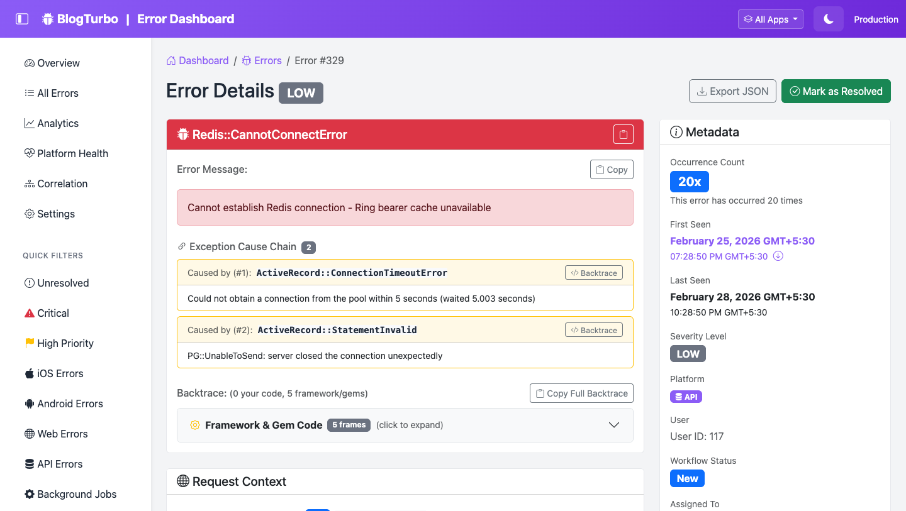

# Rails Error Dashboard

**Advanced error tracking and monitoring for Ruby on Rails applications**

[](https://badge.fury.io/rb/rails_error_dashboard)
[](https://github.com/AnjanJ/rails_error_dashboard/actions)

## Features

✨ **Real-Time Error Tracking** - Capture and monitor errors as they happen

🔔 **Multi-Channel Notifications** - Slack, Email, Discord, PagerDuty, Webhooks

📊 **Advanced Analytics** - Baseline monitoring, platform comparison, error correlation

🎯 **Smart Grouping** - Fuzzy matching, cascade detection, pattern analysis

🔌 **Extensible** - Plugin system for custom integrations

🚀 **Production-Ready** - Async logging, sampling, separate database support

## Quick Links

- **[Get Started in 5 Minutes](docs/QUICKSTART.md)**
- **[Full Documentation](docs/README.md)**
- **[Customization Guide](docs/CUSTOMIZATION.md)**
- **[API Reference](docs/API_REFERENCE.md)**
- **[Plugin System](docs/PLUGIN_SYSTEM.md)**

## Installation

```ruby
# Gemfile
gem 'rails_error_dashboard'
```

```bash
bundle install
rails generate rails_error_dashboard:install
rails db:migrate
```

Visit `http://localhost:3000/errors` 🎉

## Screenshots

### Dashboard Overview


### Error Details


### Platform Comparison


## Use Cases

### For Developers
- **Quick error diagnosis** with detailed backtraces and context
- **Pattern detection** to find related issues
- **Platform comparison** to identify iOS vs Android issues

### For DevOps
- **Proactive monitoring** with baseline anomaly detection
- **Automated alerting** for critical errors
- **Performance tracking** with error rate trends

### For Product Teams
- **User impact analysis** to prioritize fixes
- **Release quality** tracking with version correlation
- **Platform health** dashboards

## Documentation

### Getting Started
- [Quickstart Guide](docs/QUICKSTART.md) - 5-minute setup
- [Configuration](docs/guides/CONFIGURATION.md) - Complete reference
- [Notifications](docs/guides/NOTIFICATIONS.md) - Set up alerts

### Advanced Features
- [Baseline Monitoring](docs/features/BASELINE_MONITORING.md) - Anomaly detection
- [Platform Comparison](docs/features/PLATFORM_COMPARISON.md) - Cross-platform analysis
- [Error Correlation](docs/features/ERROR_CORRELATION.md) - Release tracking
- [Advanced Grouping](docs/features/ADVANCED_ERROR_GROUPING.md) - Smart matching

### Customization
- [Customization Guide](docs/CUSTOMIZATION.md) - Customize everything
- [Plugin System](docs/PLUGIN_SYSTEM.md) - Build integrations
- [API Reference](docs/API_REFERENCE.md) - Complete API docs

## Contributing

We welcome contributions! See [CONTRIBUTING.md](CONTRIBUTING.md) for guidelines.

## License

MIT License. See [LICENSE](LICENSE) for details.

## Support

- **Issues**: [GitHub Issues](https://github.com/AnjanJ/rails_error_dashboard/issues)
- **Discussions**: [GitHub Discussions](https://github.com/AnjanJ/rails_error_dashboard/discussions)
- **Documentation**: [docs/](docs/README.md)

---

**Made with ❤️ for the Rails community**
